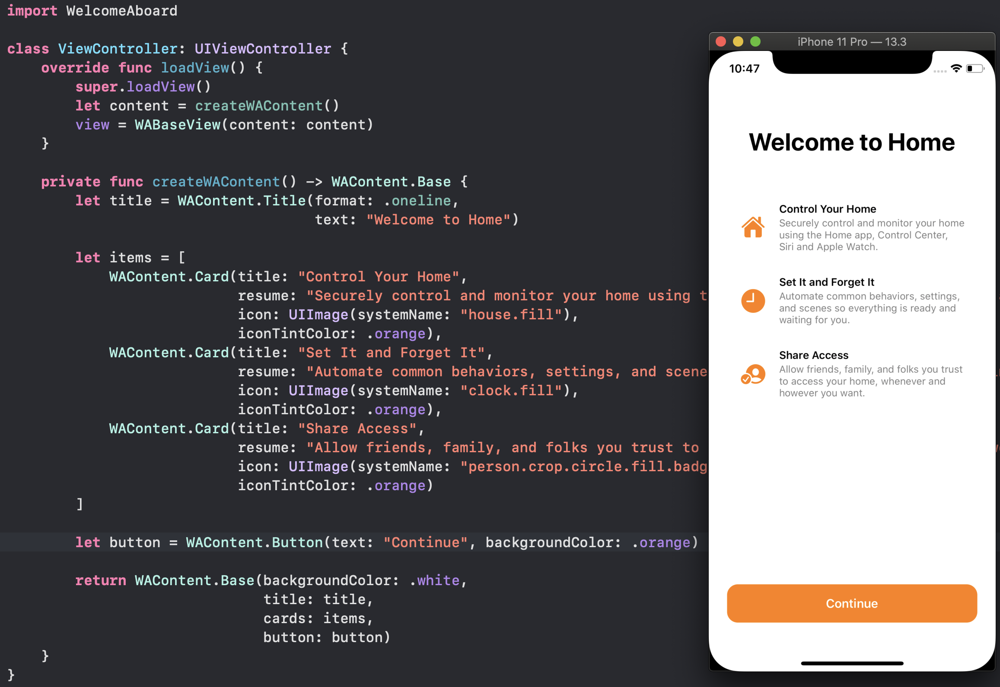

<p align="center">
    
</p>

<p align="center">
    
    <a href="https://swift.org/package-manager">
        
    </a>
     
    <a href="https://twitter.com/leandroromn">
        
    </a>
</p>

Welcome to **WelcomeAboard**, a small pod to receive new users with a classic iOS style visual.

This repository was created to facilitate the creation of a welcome screen based on iOS views for native apps. Fully customizable and smaller.

## Installation
### CocoaPods
This project was built to use with CocoaPods in your application. To install **WelcomeAboard** on your iOS project, add the following line to your `Podfile`:
```ruby
pod 'WelcomeAboard'
```
Then, run the command on terminal:
```bash
$ pod install
```
Congratulations! **WelcomeAboard** has been successfully installed on your project. 😄

## How to use
First, add `import WelcomeAboard` line on top of your ViewController's code to import the pod.
Then, create the required models to fill up the `WABaseView` and sub-components.

In this following example, we will re-create the welcome view from the **Home** app.
*Please, extract your strings to a constant file or similar.* 😝
<p align="center">
    
</p>

You can copy the following code and paste in your project to get the same result above:
```swift
import WelcomeAboard // UIKit import is no longer required because WelcomeAboard import UIKit internally.

class ViewController: UIViewController {
    override func loadView() {
        super.loadView()
        let content = createWAContent()
        view = WABaseView(content: content)
    }

    private func createWAContent() -> WAContent.Base {
        let title = WAContent.Title(format: .oneline,
                                    text: "Welcome to Home")

        let items = [
            WAContent.Card(title: "Control Your Home",
                           resume: "Securely control and monitor your home using the Home app, Control Center, Siri and Apple Watch.",
                           icon: UIImage(systemName: "house.fill"),
                           iconTintColor: .orange),
            WAContent.Card(title: "Set It and Forget It",
                           resume: "Automate common behaviors, settings, and scenes so everything is ready and waiting for you.",
                           icon: UIImage(systemName: "clock.fill"),
                           iconTintColor: .orange),
            WAContent.Card(title: "Share Access",
                           resume: "Allow friends, family, and folks you trust to access your home, whenever and however you want.",
                           icon: UIImage(systemName: "person.crop.circle.fill.badge.checkmark"),
                           iconTintColor: .orange)
        ]

        let button = WAContent.Button(text: "Continue", backgroundColor: .orange)

        return WAContent.Base(backgroundColor: .white,
                              title: title,
                              cards: items,
                              button: button)
    }
}
```
In this example, `WABaseView` was created inside `loadView` method, but this is not required. You can create the `WABaseView` whereaver you want.

## Content models

### WAContent.Base
A container for other models to build `WABaseView`.

Name | Type | Required
------------ | ------------- | -------------
*backgroundColor* | `UIColor`  | ✅
*title* | `WAContent.Title`  | ✅
*cards* | `[WAContent.Card]`  | ✅
*button* | `WAContent.Button`  | ✅

### WAContent.Title
The model responsible for the title view.

Name | Type | Required
------------ | ------------- | -------------
*format* | `WAContent.Title.Format` | ✅
*text* | `String` | ✅

### WAContent.Title.Format
The model responsible for the format of title view.
You can choose between `.oneline` to get same result of the example or select the `.multiline` option to specify the welcome text and title text.
- `.oneline`
- `.multiline`
    - `welcomeText: String`

Name | Type | Required
------------ | ------------- | -------------
*textAlignment* | `NSTextAlignment` | 🟨

### WAContent.Card
The model responsible for the `WACardView` view.
The property `iconTintColor` is not required. The default value is `.black`.

Name | Type | Required
------------ | ------------- | -------------
*title* | `String` | ✅
*titleFont* | `UIFont` | ✅
*resume* | `String` | ✅
*resumeFont* | `UIFont` | ✅
*icon* | `UIImage?` | ✅
*iconTintColor* | `UIColor?` | ❌ 

### WAContent.Button
The model responsible for the `WAPrimaryButton` button.
The property `action` is not required. Remember to use `weak self` to avoid retain-cycles.

Name | Type | Required
------------ | ------------- | -------------
*text* | `String`  | ✅
*backgroundColor* | `UIColor`  | ✅
*action* | `(() -> Void)?`  | ❌ 
```swift
let button = WAContent.Button(text: "Continue", backgroundColor: .orange) { [weak self] in
    self?.dismiss(animated: true)
}
```

## Credits
WelcomeAboard was originally written by [Leandro Romano](https://www.linkedin.com/in/leandroromn/) with a simple goal of accelerating development with a welcome preview that become standard in Apple's native apps.

The Welcome view layout was created by [Apple](http://apple.com/).

## Contributions and support
Feel free to send suggestions or even a Pull Request. 
If the change makes sense, it will certainly be part of the project. 😁 

If you make changes with visual effects, remember to run/update the snapshot tests.

Have fun using **WelcomeAboard** 🛳